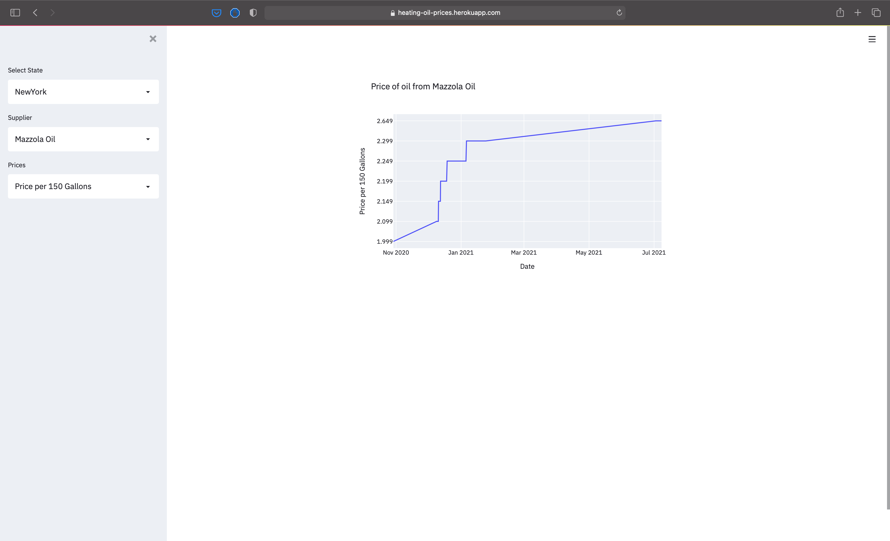

# Time Series forecasting on Heating Oil Prices

Here, in upstate New York, we are able to get natural gas for heating, so we need to rely on oil, which is distrubed though multiple companies. The price of oil, just like gas, is different between companies and parts of the year. 

As a homeowner, I wanted a way to know what the price of oil was in the past, and what might the price be in the future.

# Introduction & Goals
This end-to-end project goes over the following:
- Bulidng a historical dataset of the price of heating oil using the web scraping tool Beautiful Soup.
- Building a AWS Lambda function to scrape for heating oil prices.
- Saving the data to Amazon S3.
- Amazon Lambda function to write incoming data from S3 to DynamoBD.
- Building a Time-Series forcasting model to predict average price of heating oil in New York State.
- Display historical heating oil prices on dashboard using Streamlit.

# Contents

- [Heating Oil Price Dataset](#heating-oil-price-dataset)
- [Scripts](#scripts)
  - [Scraper Lambda](#scraper-lambda)
  - [S3 to DynamoDB Lambda](#s3-to-dynamodb-lambda)
- [Forecasting](#forecasting)
- [Visualization](#visualization)
- [Demo](#demo)
- [Follow Me On](#follow-me-on)

# Heating Oil Price Dataset
The dataset is generated through scraping of the website cheapestoil.com, which displays the current price of heating oil in the northeast United States. This site only show the current price and not the historical prices. 
In December 2020, I had built a python script to scrape the data on the website, in which the script was run every 6 hours. 

# Scripts

## Scraper Lambda

This [script](lambda_functions/get_prices_lambda.py) is deployed as a AWS Lambda function and preforms the following tasks:
- Read the contents of https://www.cheapestoil.com
- Navigate to the dropdown list of locations on the main site
- For each location, grab the name of the item and read the contents from the page.
`https://www.cheapestoil.com/heating-oil-prices/{location}`
This page shows the current price of oil for many companies in a table
- For each row on the page, I used beautifulSoup to read the supplier name, last updated field and the price of oil by number of gallons.
- Save this data into a list of dictionaies
- convert this list into JSON
- Upload to Amazon S3

## S3 to DynamoDB Lambda
This [script](lambda_functions/s3_to_dynamodb._lambda.py) is another AWS Lambda function that is triggered by an S3 Put operation.
When a new JSON file is uploaded to S3, this script does the following:
- Read the incoming S3 object as JSON
- For each item in the JSON list, add the element which includes the supplier name, last updated date, and the prices per gallon

# Forecasting
After months of gathering data, I generated a 7 day forecast on the avgerage price of heating oil for New York. The model was built using the PyCaret libary. 
The [script](scripts/train.py) using PyCaret to select the best time series model for the given data for each set of prices. 
- The data used for forecasting uses the average price over all suppliers in New York State
- The script first selects the best model using the Mean Absolute Error(MAE) for each set of prices(`price150`, `price300` and `price500`)
- After the model is selected, the model is saved to a file

I've written a [blog post](https://www.tonyhung.xyz/2021/07/07/HeatingOilPrices-TimeSeries.html) that describes the model forecasting in futher detail.

# Visualization
I've used Streamlit to display the historical prices for each supplier in each state. The dashboard is available [here](https://heating-oil-prices.herokuapp.com).
On the dashboard, you are able to view the historical price by state, supplier and the price per gallon. 
The plot on the right will show the price using the selected options. 

# Demo
https://heating-oil-prices.herokuapp.com

# Follow Me On
https://twitter.com/Thung

https://www.linkedin.com/in/antonio-hung-5163b77/

